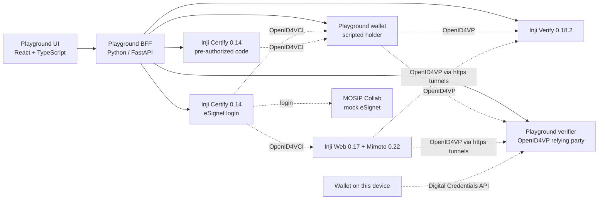

# Inji Interoperability Playground

MOSIP Decode 2026. A web app that runs a real issue → hold → present → verify cycle
across Inji Certify, Inji Web and Inji Verify, shows every protocol message on the
way, and records whether each module behaved the way the standards say it should.

Pick an issuer, a wallet and a verifier, pick a credential format and a scenario,
press Run. The playground drives the whole exchange (OpenID4VCI for issuance,
OpenID4VP for presentation) and checks the verifier's answer against what the
standards expect. Where they disagree, that's an interoperability gap, and it lands
in the report.

## How it fits together



The UI only ever talks to the BFF. The BFF runs the flows with the same tested
modules each pipeline was built with (`certify/scripts/issuance_flow.py`,
`verify/scripts/presentation_flow.py`), so what the playground shows is what the
protocol actually did.

Both Certify instances share one database and one keystore, so they are the same
issuer with the same `did:web`. One logs holders in through eSignet, which is what
Inji Web uses. The other is its own authorization server and writes the credential
offer itself (pre-authorized code), so the person's details travel with each offer.

| Folder | What's in it | Owner |
|---|---|---|
| [`certify/`](certify/README.md) | Inji Certify issuing JSON-LD, SD-JWT and mDoc credentials, and the OpenID4VCI flows | Chirayu |
| [`wallet/`](wallet/README.md) | Inji Web + Mimoto as the holder, wired to our Certify | Navish |
| [`verify/`](verify/README.md) | Inji Verify, the OpenID4VP flow, the scripted holder wallet and independent checks | Shivek |
| [`playground/`](playground/README.md) | The BFF, the Playground verifier and the Playground UI | Whole team |
| [`integration/`](integration/) | One command to start, stop and check everything | Whole team |

## Run it

You need **Docker Desktop** (give it about 12 GB of memory), **Git**, **Python 3** (only to
run the start script; nothing to install with pip) and an internet connection (the
eSignet login and the https tunnels need it). Node isn't needed: the Playground is built
inside Docker.

**1. Private files.** These are never committed. Get them from Chirayu, by direct message:

| File | What it is |
|---|---|
| `wallet/docker-compose/.env` | Google sign-in for Inji Web. Or make your own OAuth client, see [`wallet/README.md`](wallet/README.md) step 3 |
| `certify/docker-compose/data/CERTIFY_PKCS12/local.p12` | The issuer's signing keystore |
| `certify/docker-compose/keys_seed.local.sql` | The database rows that go with it |

Then create `certify/docker-compose/docker-compose.override.yaml` with exactly this:

```yaml
services:
  database:
    volumes:
      - ./keys_seed.local.sql:/docker-entrypoint-initdb.d/zz_keys_seed.sql
```

The seed only loads into a fresh Certify database. If you've run Certify on this machine
before, wipe its database once: `docker compose -f certify/docker-compose/docker-compose.yaml down -v`.

Without the signing key everything still runs, but Certify signs with a key of its own
that doesn't match the published DID, so verifiers reject its credentials. The header's
"DID keys" dot turns amber when that happens.

To sign in to Inji Web, your Google account has to be a test user on the OAuth client
(Chirayu adds it in the Google Cloud console, Audience → Test users).

**2. Start everything, one command:**

```bash
python3 integration/stack.py up       # Windows: py integration\stack.py up
python3 integration/stack.py status   # repeat until everything says up; the first boot takes a few minutes
```

That starts both Certify instances, Inji Verify, Mimoto and Inji Web, two https tunnels
(Inji Web only presents to https addresses), and builds and starts the Playground itself.
Open **http://localhost:5050**. The API reference is at http://localhost:5050/docs.

Stop with `python3 integration/stack.py down`. Databases and keys are kept.

Working on the Playground's code? Run `python3 integration/stack.py up --no-playground`,
then the BFF and UI from source, see [`playground/README.md`](playground/README.md).

### On Windows, step by step

1. **Install** [Docker Desktop](https://www.docker.com/products/docker-desktop/) (keep the
   WSL 2 backend it suggests), [Git for Windows](https://git-scm.com/download/win) and
   [Python 3](https://www.python.org/downloads/) (tick "Add python.exe to PATH").
2. **Give Docker enough memory.** Create `C:\Users\<you>\.wslconfig` containing:
   ```ini
   [wsl2]
   memory=12GB
   ```
   then run `wsl --shutdown` in PowerShell and start Docker Desktop again.
3. **Clone** in PowerShell:
   ```powershell
   git clone https://github.com/Mushmat/inji_sandbox.git
   cd inji_sandbox
   ```
   Use a fresh clone rather than an old one. The repo forces Linux line endings
   (`.gitattributes`), and a clone made before that was added can still have Windows
   ones, which break scripts inside the containers.
4. **Put the private files in place** (step 1 above, same paths with `\`). To create the
   override file: `notepad certify\docker-compose\docker-compose.override.yaml`, paste the
   YAML above, save.
5. **Start it:**
   ```powershell
   py integration\stack.py up
   py integration\stack.py status
   ```
   Allow the firewall prompts for Docker if Windows shows them. On a regular Intel or AMD
   laptop this is faster than on a Mac, because the MOSIP images run without emulation.
6. **Open http://localhost:5050.** Every dot in the header should be green, including
   "DID keys match".

If something is in the way:

| Problem | Fix |
|---|---|
| `py` isn't found | Use `python` instead |
| Port 8080 is already taken | `$env:VERIFY_PORT="8082"; py integration\stack.py up` |
| "DID keys mismatch" in the header | The seed didn't load: check the four files, then `docker compose -f certify\docker-compose\docker-compose.yaml down -v` and `up` again |
| Services stay "not ready" | Docker needs more memory (step 2), or give it a few more minutes on the first boot |

## What's covered

| Requirement | Where |
|---|---|
| FR1 Certify, Mimoto + Inji Web and Inji Verify connected end to end | `python integration/stack.py up` |
| FR2 Issuer → Wallet → Verifier selector | Test bench |
| FR3 Live issuance over OpenID4VCI (offer, token exchange, credential) | Inspector, Issue phase. With the pre-authorized Certify, the offer is Certify's own |
| FR4 Live presentation over OpenID4VP, Valid / Invalid / Valid-but-Expired | Inspector; Inji Web by deep link, phone wallets by QR |
| FR5 Protocol inspector with raw payloads | Every step's sent and received JSON, JWTs decodable in place |
| FR6 JSON-LD and SD-JWT end to end, labelled per run | Format picker, run header, report |
| FR7 Pass/fail report per run | Report tab, markdown export at `/api/report.md` |
| FR8 Non-Inji participants | Test issuer (did:key), Playground wallet, Playground verifier |
| FR9 mDoc / mDL | Certify issues it; the run records why Inji Web and Inji Verify can't take it |
| FR10 Sequence diagram | Inspector, "Sequence diagram" tab, drawn live |
| FR11 Replay and tamper mode | Scenario picker: altered, replayed, wrong type, forged issuer, expired |
| FR12 Run history with filters | Report tab: format, verdict, wallet, verifier, module versions |
| FR13 Same-device flow | Inji Web by deep link; any wallet on the device through the Digital Credentials API |
| FR14 CI-style test suite | Test matrix on the Report tab, `playground/run_matrix.py`, nightly GitHub workflow |
| FR16 Success rate and latency per flow | Report tab, "Flow health" |
| FR17 One-command Docker Compose bundle | `python integration/stack.py up` |

Not done: FR15 (filing the gaps as issues on MOSIP's repositories) is the team's call.
F10 in the findings lets anyone forge credentials that Inji Verify accepts, so it should
go to MOSIP privately first.

The Digital Credentials API path is built to OpenID4VP's DC API mode and tested with a
scripted wallet answer. Completing it live needs a browser and a wallet on the device
that support the API and hold one of our Farmer credentials.

## Tests

```bash
python -m unittest discover -s playground/bff/tests -p "test_*.py"   # Playground: verifier scenarios over HTTP, rules, report
cd verify/scripts && ALLOW_REMOTE_CONTEXTS=0 python -m unittest discover -s tests   # Present & verify, offline
cd certify/scripts && python -m unittest test_credential_shape.py                   # Issuance, needs Certify running
cd playground/web && npm test                                                        # UI helpers
```

`.github/workflows/tests.yml` runs the offline suites on every push. The nightly workflow
brings up Certify and Inji Verify on a GitHub runner and runs the full matrix; it needs the
signing key as repository secrets (see the workflow file).

## What we found

The interoperability gaps we hit, with how to reproduce each one, are in
[`verify/docs/FINDINGS.md`](verify/docs/FINDINGS.md), the "Known gaps" section of
[`wallet/README.md`](wallet/README.md), and "What we found" in
[`certify/README.md`](certify/README.md). The playground links each failed run to the
finding it most likely shows.

## Ports

| Port | Service |
|---|---|
| 5050 | Playground (UI, BFF and Playground verifier) |
| 8090 / 8091 | Inji Certify, eSignet login / its nginx |
| 8092 | Inji Certify, pre-authorized code |
| 8080 | Inji Verify |
| 3004 | Inji Web |
| 8099 | Mimoto |
| 5433, 5434, 55432 | Postgres for Certify, Verify, Mimoto |

## Team

Four people: issuer and backend, wallet, verifier and protocol, playground UI and docs.
