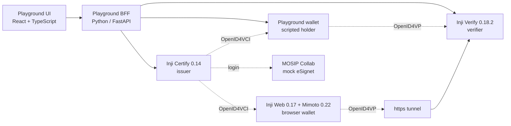

# Inji Interoperability Playground

MOSIP Decode 2026. A web app that runs a real issue → hold → present → verify cycle
across Inji Certify, Inji Web and Inji Verify, shows every protocol message on the
way, and records whether each module behaved the way the standards say it should.

Pick an issuer, a wallet and a verifier, pick a credential format, press Run. The
playground drives the whole exchange (OpenID4VCI for issuance, OpenID4VP for
presentation), then checks Inji Verify's answer against its own independent checks.
Where the two disagree, that's an interoperability gap, and it lands in the report.

## How it fits together



The UI only ever talks to the BFF. The BFF runs the flows with the same tested
modules each pipeline was built with (`certify/scripts/issuance_flow.py`,
`verify/scripts/presentation_flow.py`), so what the playground shows is what the
protocol actually did.

| Folder | What's in it | Owner |
|---|---|---|
| [`certify/`](certify/README.md) | Inji Certify issuing JSON-LD, SD-JWT and mDoc credentials, and the OpenID4VCI flow | Chirayu |
| [`wallet/`](wallet/README.md) | Inji Web + Mimoto as the holder, wired to our Certify | Navish |
| [`verify/`](verify/README.md) | Inji Verify, the OpenID4VP flow, the scripted holder wallet and independent checks | Shivek |
| [`playground/`](playground/README.md) | The BFF and the Playground UI that tie the three together | Whole team |
| [`integration/`](integration/) | One script to start, stop and check the whole stack | Whole team |

## Run it

You need Docker Desktop (give it about 12 GB of memory), Python 3.9+, Node 20+ and
an internet connection (logins go through MOSIP Collab's mock eSignet).

**1. Private files.** These are not in git. Get them from a teammate, or make your own:

| File | What it is | How to get it |
|---|---|---|
| `wallet/docker-compose/.env` | Google sign-in for Inji Web | Your own OAuth client, see [`wallet/README.md`](wallet/README.md) step 3 |
| `certify/docker-compose/data/CERTIFY_PKCS12/local.p12` and `certify/docker-compose/keys_seed.local.sql` | The issuer's signing key | From Chirayu, see [`certify/README.md`](certify/README.md) "Running this issuer on another machine" |

Without the signing key your Certify still works, but it signs with its own new key,
which doesn't match the published DID, so verifiers reject its credentials. The
playground's header tells you if that's the case.

**2. Python environment** (once):

```bash
python3 -m venv .venv
source .venv/bin/activate            # Windows: .venv\Scripts\activate
pip install -r playground/bff/requirements.txt
```

**3. Start the stack** (Certify, Inji Verify, the https tunnel, Inji Web):

```bash
python integration/stack.py up
python integration/stack.py status   # repeat until everything says up; first boot takes a few minutes
```

**4. Build the UI and start the playground** (the build is needed once, and after UI changes):

```bash
cd playground/web && npm install && npm run build && cd ../..
python playground/bff/main.py
```

Open **http://localhost:5050**. The API reference is at http://localhost:5050/docs.

Stop everything with `python integration/stack.py down`. Databases and keys are kept.

## What's covered

| Requirement | Where |
|---|---|
| FR1 Certify, Mimoto + Inji Web and Inji Verify connected end to end | `integration/stack.py`, each component's compose file |
| FR2 Issuer → Wallet → Verifier selector | Playground "Test bench" |
| FR3 Live issuance over OpenID4VCI (offer, token exchange, credential) | Inspector, Issue phase |
| FR4 Live presentation over OpenID4VP with Valid / Invalid / Expired | Inspector, Present and Verify phases; Inji Web through a deep link |
| FR5 Protocol inspector with raw payloads | Inspector, every step's sent and received JSON, JWTs decodable in place |
| FR6 JSON-LD and SD-JWT end to end, labelled per run | Format picker, run header, report |
| FR7 Pass/fail report per run | Report tab, markdown export at `/api/report.md` |
| FR8 Non-Inji participants | Test issuer (did:key) and the Playground wallet |
| FR9 mDoc / mDL | Certify issues it; the run records why Inji Web and Inji Verify can't take it |
| FR10 Sequence diagram | Inspector, "Sequence diagram" tab, drawn live from the run |
| FR11 Replay and tamper mode | Scenario picker: altered, replayed, wrong type, forged issuer, expired |
| FR12 Run history with filters | Report tab: format, verdict, wallet, verifier, module versions |

## What we found

The interoperability gaps we hit, with how to reproduce each one, are in
[`verify/docs/FINDINGS.md`](verify/docs/FINDINGS.md) and the "Known gaps" section of
[`wallet/README.md`](wallet/README.md). The playground links each failed run to the
finding it most likely shows.

## Ports

| Port | Service |
|---|---|
| 5050 | Playground (UI + BFF) |
| 8090 / 8091 | Inji Certify / its nginx |
| 8080 | Inji Verify |
| 3004 | Inji Web |
| 8099 | Mimoto |
| 5433, 5434, 55432 | Postgres for Certify, Verify, Mimoto |

## Team

Four people: issuer and backend, wallet, verifier and protocol, playground UI and docs.
